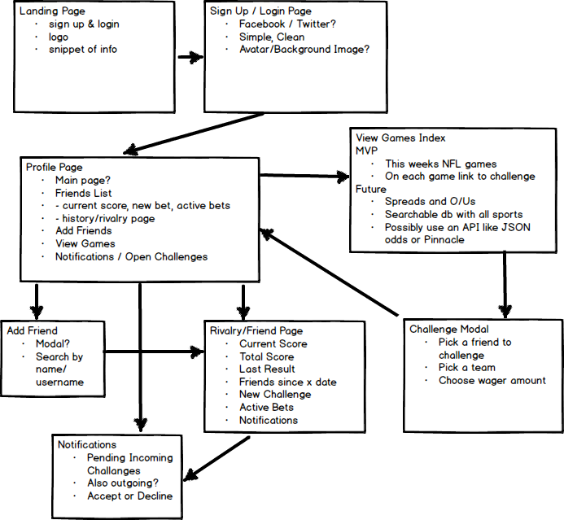

# **Challengr README**
Link to Challengr: http://challengr.colinchan.net/
GitHub Repo: https://github.com/colinchan89/Challengr

Challengr ~~is~~ will be a web-based social network with an emphasis on sports
betting. The social aspect is simple, users will be able to find and add friends
based on their username. The app will also display the upcoming week's NFL
schedule and betting lines. The user will be able to click on the game and
challenge a friend. The database will also track betting history between friends
as well as a cumulative score if you want to bet real money!

## Wireframe

## Technologies Used
- Node, Express, MongoDB, React.js
- HTML, CSS, Materialize, AJAX
- Node packages: Body-Parser, Mongoose, Morgan, Path

## Getting Started
Clone this repository. Run `npm install` to install package dependencies. Run
`node server.js` or `nodemon` to get the local server up and running. Visit
`localhost:3000`.

## Using The App
The app has not even reached the alpha stage yet, stay tuned for updates!

## What's Next?
Most importantly to improve this app, I must first improve my React skills.
Most pertinent next steps are to implement full CRUD actions on the game model
and implement User authentication and sessions.
